<div align="center">

# Deployfolio

**Verified engineering portfolios for developers and evidence-driven talent discovery for hiring teams.**

[](https://nextjs.org/)
[](https://nestjs.com/)
[](https://www.postgresql.org/)
[](https://www.typescriptlang.org/)
[](https://github.com/AmzBG/Deployfolio/actions)

<br />

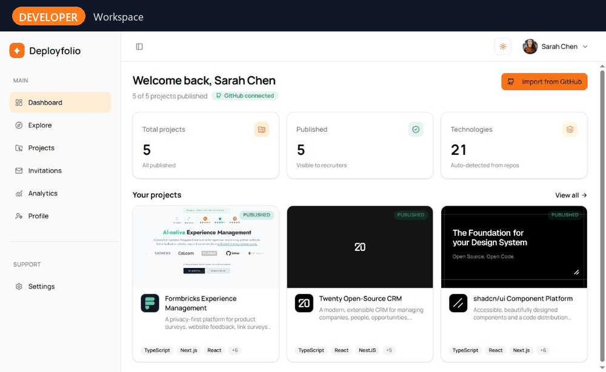

</div>

## Overview

Deployfolio turns GitHub work into structured, verifiable portfolios. Developers can import repositories, publish project pages with verified collaborators, and understand who is viewing their work. Hiring teams can sign in to discover developer profiles through the projects candidates have actually built, save promising candidates, and move them through a lightweight recruiting pipeline. Published project pages are publicly accessible; developer profiles require authentication.

The platform is a production-oriented Turborepo with a Next.js frontend, NestJS API, shared Zod contracts, PostgreSQL with pgvector, Redis-backed queues, S3-compatible media storage, GitHub integration, and role-aware administration.

## Product tour

<table>
  <tr>
    <th width="33%">Developer workspace</th>
    <th width="33%">Project discovery</th>
    <th width="33%">Developer profile</th>
  </tr>
  <tr>
    <td>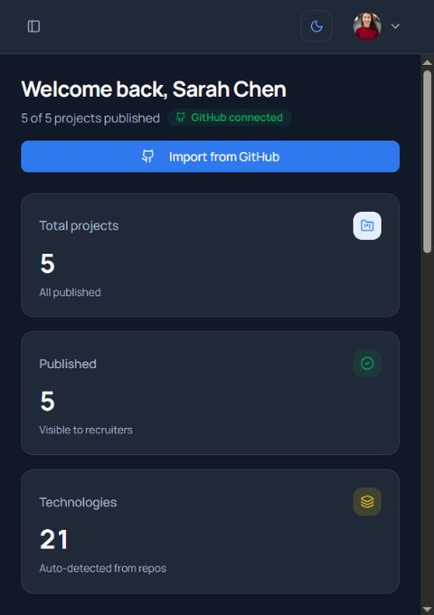</td>
    <td>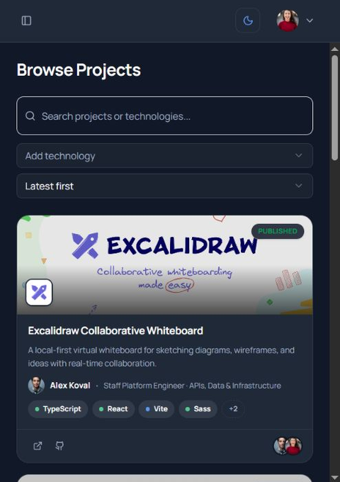</td>
    <td>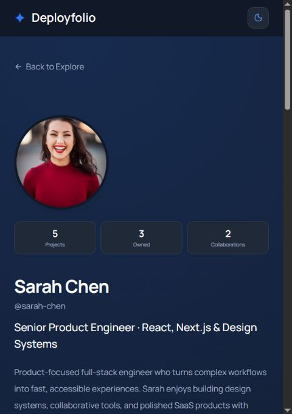</td>
  </tr>
  <tr>
    <td>GitHub import, publishing status, and automatically detected technology statistics.</td>
    <td>Searchable project cards with verified contributors, technologies, repositories, and live demos.</td>
    <td>An authenticated, recruiter-friendly profile backed by published projects and verified collaboration.</td>
  </tr>
</table>

<table>
  <tr>
    <th>Recruiter workspace</th>
  </tr>
  <tr>
    <td>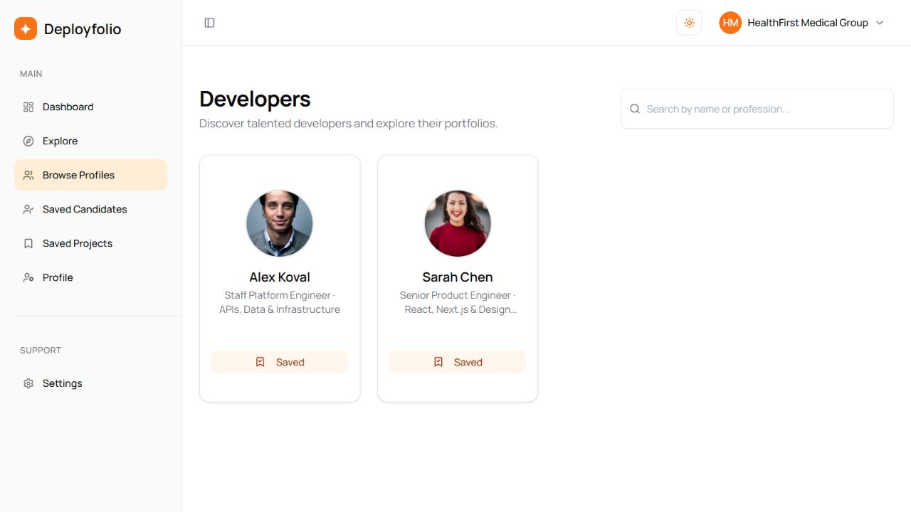</td>
  </tr>
  <tr>
    <td>Talent discovery with candidate search, engineering profiles, and save-to-pipeline actions.</td>
  </tr>
</table>

<table>
  <tr>
    <th>Administration</th>
  </tr>
  <tr>
    <td>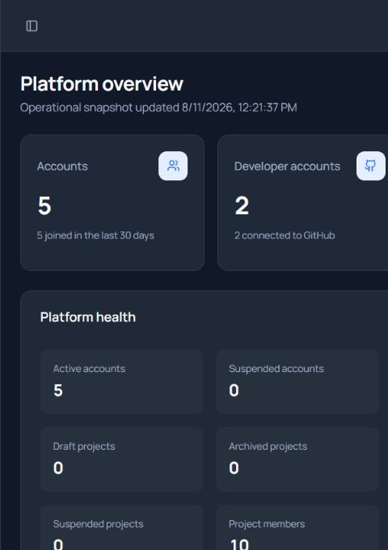</td>
  </tr>
  <tr>
    <td>Full-width visibility into accounts, projects, moderation, technologies, and operational health.</td>
  </tr>
</table>

## Search and recruiting workflows

<table>
  <tr>
    <th>Natural-language project discovery</th>
  </tr>
  <tr>
    <td>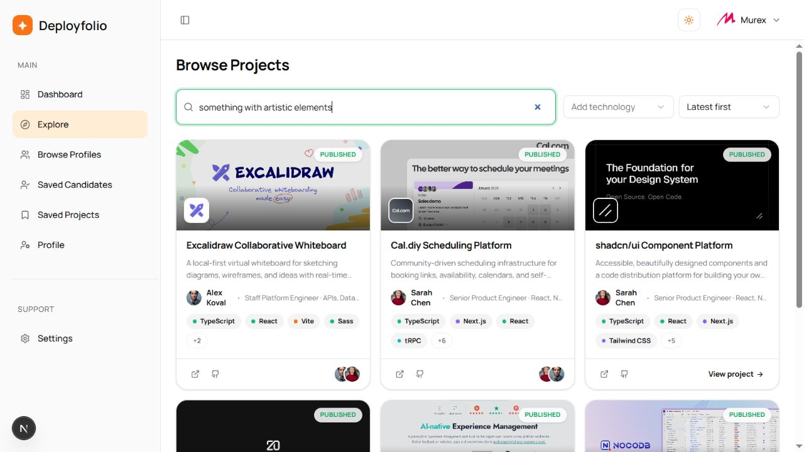</td>
  </tr>
  <tr>
    <td>The query <code>something with artistic elements</code> uses embedding-powered semantic ranking to surface visually relevant engineering work.</td>
  </tr>
</table>

<table>
  <tr>
    <th>Multi-technology filtering</th>
  </tr>
  <tr>
    <td>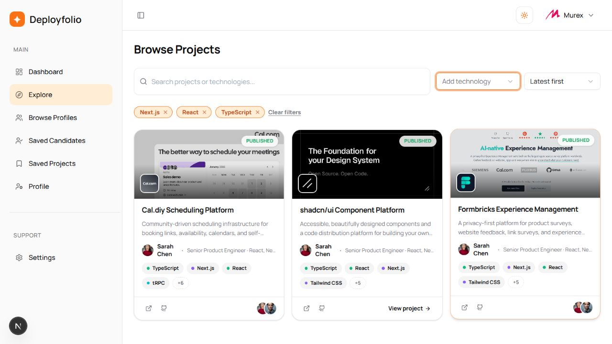</td>
  </tr>
  <tr>
    <td>Recruiters can combine technology filters such as <code>Next.js</code>, <code>React</code>, and <code>TypeScript</code> to narrow results to projects with the complete stack.</td>
  </tr>
</table>

<table>
  <tr>
    <th>Candidate pipeline</th>
  </tr>
  <tr>
    <td>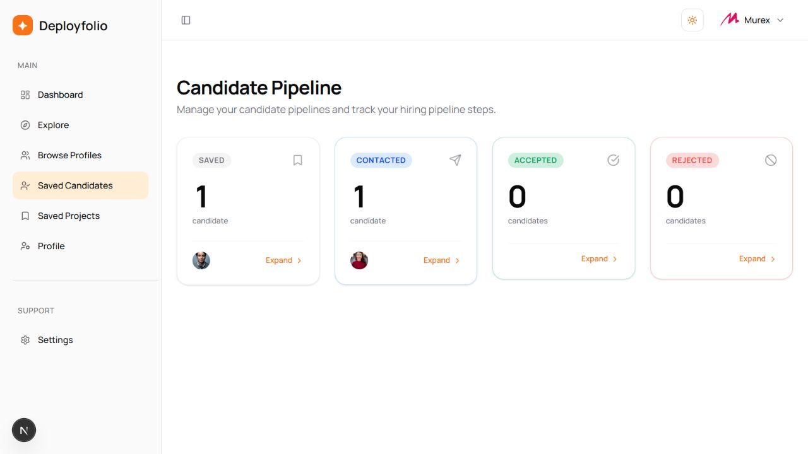</td>
  </tr>
  <tr>
    <td>A widescreen pipeline keeps candidates visible in order across <code>SAVED</code>, <code>CONTACTED</code>, <code>ACCEPTED</code>, and <code>REJECTED</code> stages.</td>
  </tr>
</table>

<table>
  <tr>
    <th>AI-assisted profile writing</th>
  </tr>
  <tr>
    <td>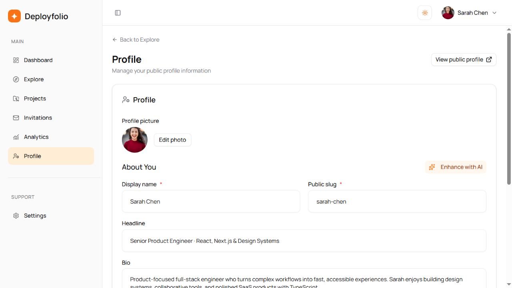</td>
  </tr>
  <tr>
    <td>Developers can use project-aware AI assistance to improve their headline and biography while retaining control of the final profile copy.</td>
  </tr>
</table>

## Core capabilities

### For developers

- Connect GitHub and import supported public repositories.
- Scan repository metadata and source signals to detect technologies.
- Generate portfolio-ready repository summaries with AI assistance.
- Publish project pages with images, GIFs, videos, diagrams, deployment links, and repository links.
- Verify project ownership and collaborator relationships through GitHub.
- Invite contributors with owner, editor, or contributor roles.
- Build an authenticated developer profile from owned and verified collaborative work.
- Publish individual project pages for public viewing.
- Track portfolio views, project views, unique visitors, referrers, and recruiter traffic.
- Improve profile copy with project-aware AI suggestions.

### For hiring teams

- Search developers and projects using keyword and semantic discovery.
- Filter projects by technology and sorting criteria.
- Save projects with private notes.
- Save developers to a candidate pipeline with `SAVED`, `CONTACTED`, `REJECTED`, and `ACCEPTED` stages.
- Evaluate developers through visible project evidence and verified collaboration history.

### For platform operators

- Moderate accounts and projects from a super-admin workspace.
- Suspend, restore, archive, and review content with auditable actions.
- Process analytics and email work asynchronously through BullMQ.
- Store media in S3-compatible object storage, with MinIO available locally.
- Send transactional mail through Brevo, with Mailpit available during development.

## Architecture

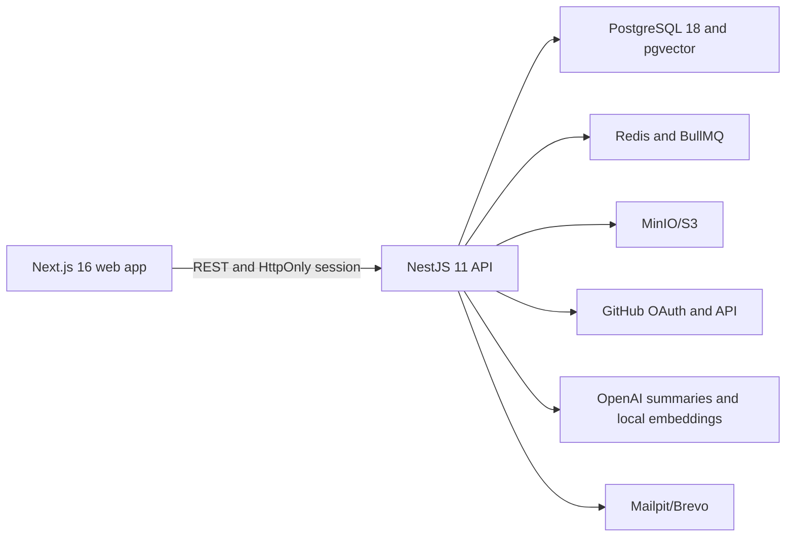

Repository analysis combines deterministic technology rules with repository metadata. Portfolio and developer search use local `all-MiniLM-L6-v2` embeddings stored in pgvector, with keyword search as a fallback. OpenAI is used for repository summaries and profile enhancement, not for the core search embedding pipeline.

## Technology stack

| Area            | Technology                                                            |
| --------------- | --------------------------------------------------------------------- |
| Web             | Next.js 16, React 19, Tailwind CSS 4, shadcn/ui, SWR, React Hook Form |
| API             | NestJS 11, Swagger/OpenAPI, cookie-based sessions, Zod validation     |
| Contracts       | Shared Zod request and response schemas in `packages/contracts`       |
| Data            | PostgreSQL 18, Prisma 7, pgvector                                     |
| Background work | Redis, BullMQ                                                         |
| AI              | OpenAI API, Transformers.js, `all-MiniLM-L6-v2`                       |
| Media           | AWS S3-compatible storage, MinIO for local development                |
| Email           | Brevo, Mailpit                                                        |
| Tooling         | Turborepo, TypeScript, ESLint, Prettier, GitHub Actions               |
| Deployment      | AWS Amplify frontend, containerized API                               |

## Repository layout

| Path                 | Purpose                                                             |
| -------------------- | ------------------------------------------------------------------- |
| `apps/web`           | Next.js application and responsive user interface                   |
| `apps/api`           | NestJS API, authentication, integrations, and background processors |
| `packages/contracts` | Shared Zod schemas and inferred TypeScript types                    |
| `packages/database`  | Prisma client, schema, migrations, and seed data                    |
| `scripts`            | Runtime and deployment helpers                                      |
| `.github/workflows`  | Pull-request and main-branch quality gates                          |

## Local development

### Prerequisites

- Node.js `24.11.1` as specified in [`.nvmrc`](.nvmrc)
- npm `11.6.2`
- Docker Desktop or Docker Engine with Compose

### 1. Install dependencies

```bash
npm install
```

### 2. Configure local environment files

```bash
cp apps/api/.env.example apps/api/.env
cp apps/web/.env.example apps/web/.env
cp packages/database/.env.example packages/database/.env
```

The example files are ready for the bundled local services. Add GitHub, AI, and production email credentials only when testing those integrations.

### 3. Start infrastructure

```bash
npm run services:init
```

This starts PostgreSQL, Redis, Mailpit, and MinIO through Docker Compose.

### 4. Prepare the database

```bash
npx turbo run db:generate
npx turbo run db:deploy
npx turbo run db:seed
```

Use `db:deploy` for the committed migration history. Use `db:migrate -- --name <migration-name>` only when creating a new migration during development.

### 5. Run the application

```bash
npm run dev
```

| Service           | URL                          |
| ----------------- | ---------------------------- |
| Web application   | <http://localhost:3000>      |
| API               | <http://localhost:3001>      |
| API documentation | <http://localhost:3001/docs> |
| Mailpit           | <http://localhost:8025>      |
| MinIO console     | <http://localhost:9001>      |

## Seeded local accounts

Running `db:seed` creates local-only demo accounts. They all use the password `Password123!`.

| Role        | Email                          |
| ----------- | ------------------------------ |
| Developer   | `dev.sarah@example.com`        |
| Developer   | `dev.alex@example.com`         |
| Hiring team | `hiring.watson@example.com`    |
| Hiring team | `hiring.green@example.com`     |
| Super admin | `admin@bootcamp-starter.local` |

The seed also creates six published showcase projects, verified collaborator relationships, technology metadata, media, and vector embeddings.

## Environment overview

Use the committed `.env.example` files as the source of truth. Important production integrations include:

| Capability          | Variables                                                                 |
| ------------------- | ------------------------------------------------------------------------- |
| Database and queues | `DATABASE_URL`, `REDIS_URL`                                               |
| Application URLs    | `APP_URL`, `API_URL`, `NEXT_PUBLIC_API_URL`                               |
| GitHub OAuth        | `GITHUB_CLIENT_ID`, `GITHUB_CLIENT_SECRET`, `GITHUB_TOKEN_ENCRYPTION_KEY` |
| AI features         | `OPENAI_API_KEY`                                                          |
| Object storage      | `OBJECT_STORAGE_*`                                                        |
| Transactional email | `EMAIL_PROVIDER`, `AWS_REGION`, `SES_FROM_EMAIL`, `BREVO_*`               |
| Analytics privacy   | `ANALYTICS_HASH_SECRET`                                                   |

Never commit populated `.env` files or production credentials.

## Quality gates

Run the same checks used by CI before opening a pull request:

```bash
npx turbo run lint
npx turbo run check-types
npm run format:check
```

The GitHub Actions workflow runs linting, type checks, and formatting checks for pull requests and pushes to `main`.

## Security model

- Authentication uses server-side sessions stored in the private database schema and delivered through HttpOnly cookies.
- API routes are protected by default, with explicit public-route opt-outs and role guards.
- Every request and response contract is validated through shared Zod schemas.
- GitHub access tokens are stored separately from developer profile data and require an encryption key in production.
- Analytics identifies repeat visits through a configured hash secret instead of storing raw visitor identifiers.
- Repository scanning excludes sensitive file content from analysis previews.

## Deployment

- [`amplify.yml`](amplify.yml) builds the Next.js frontend for AWS Amplify.
- [`Dockerfile`](Dockerfile) produces the production NestJS API image. Set `RUN_DATABASE_MIGRATIONS=true` to apply committed migrations during container startup.
- Production deployments should provide managed PostgreSQL with pgvector, Redis, S3-compatible object storage, and an email provider through environment variables.

---

<div align="center">
Built to make engineering work easier to verify, discover, and trust.
</div>
